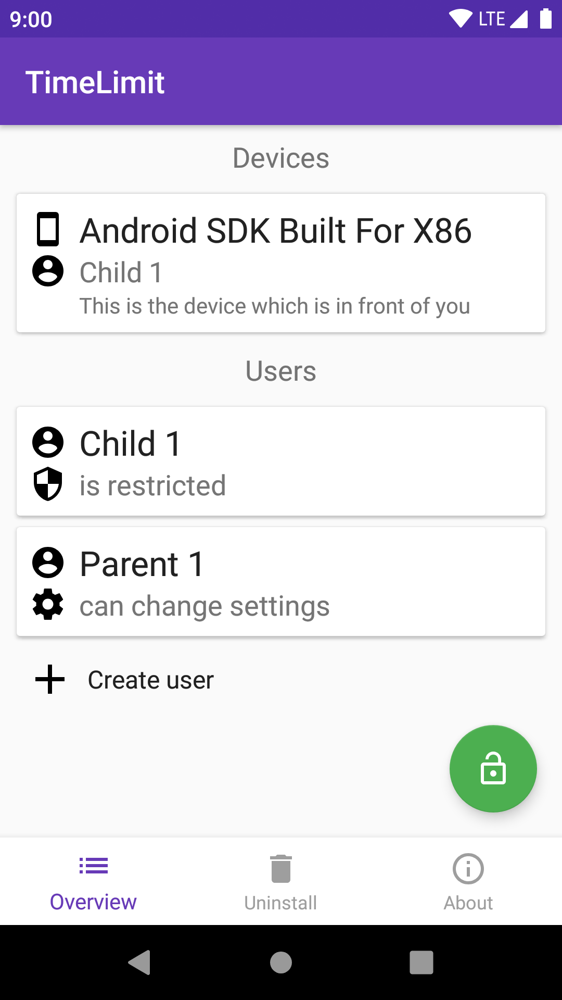
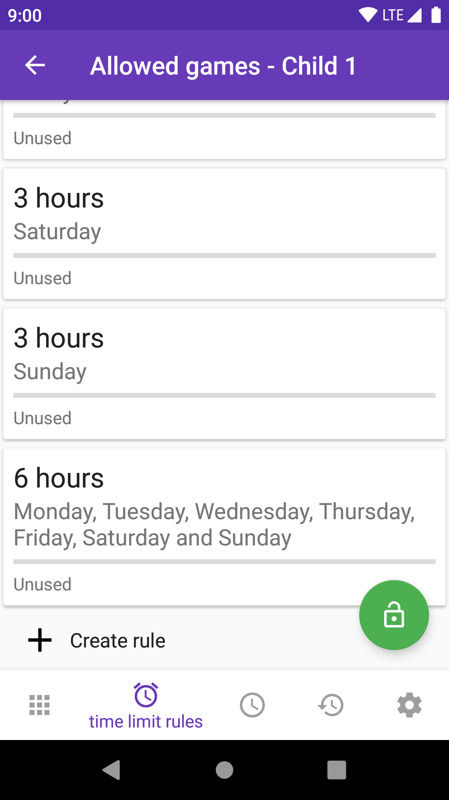

# TLPlus

This App allows setting time limits for the usage of Android phones/devices. (fork to [Open TimeLimit](codeberg.org/timelimit/opentimelimit-android))

### Building

Open it with Android Studio and press the Run button.

### Screenshots





### Enabling the device owner permission

```adb shell dpm set-device-owner io.timelimit.android.open/io.timelimit.android.integration.platform.android.AdminReceiver```
